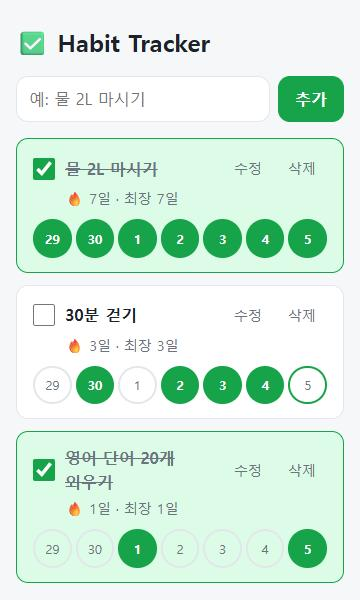
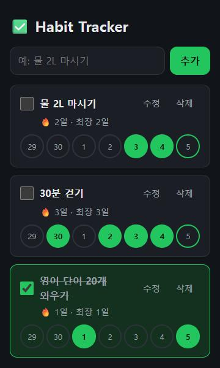

# ✅ Habit Tracker

> 매일 체크하고, 연속 기록(🔥 스트릭)으로 습관을 지키는 웹 앱


👉 **바로 써보기: https://wjamindot00.github.io/habit-tracker/**

| 라이트 | 다크 |
|---|---|
|  |  |

---

## 🎯 무엇을 하나요?

| 기능 | 설명 |
|---|---|
| ➕ 습관 추가 | "물 2L 마시기"처럼 매일 할 일을 등록 |
| ☑️ 오늘 체크 | 했으면 체크 한 번 |
| 🔥 스트릭 | 며칠 연속으로 지켰는지, 최장 기록은 며칠인지 표시 |
| 📅 최근 7일 | 동그라미로 한눈에 보고, 깜빡한 날은 눌러서 소급 체크 |
| 🌙 다크 모드 | 휴대폰·PC 설정에 맞춰 자동 전환 |
| 💾 자동 저장 | 브라우저를 닫아도 기록 유지 |

로그인 없음 · 서버 없음 · 설치 없음

## 🚀 실행하기

```bash
git clone https://github.com/wjamindot00/habit-tracker.git
cd habit-tracker
npm start            # 브라우저에서 http://localhost:3000
```

테스트:

```bash
npm test
```

> 필요한 것: [Node.js](https://nodejs.org) 18 이상 (테스트·로컬 서버용)
> `index.html`을 더블클릭으로 열면 동작하지 않아요. 브라우저 보안 정책상 모듈 스크립트는 서버를 통해서만 열 수 있으니 꼭 `npm start`로 실행하세요.

## 🗺️ 진행 상황

| | 마일스톤 | 내용 |
|---|---|---|
| ✅ | M0 | 프로젝트 셋업 |
| ✅ | M1 | 핵심 로직: 습관 추가·수정·삭제·체크 |
| ✅ | M2 | 핵심 로직: 스트릭 계산 + 저장 |
| ✅ | M3 | 최소 UI 연결 → **MVP 완성 & 첫 배포** |
| ✅ | M4 | 부가 기능: 7일 기록, 최장 스트릭 (달성률·백업은 보류) |
| ✅ | M5 | UI/UX 다듬기: 모바일 대응, 체크 피드백, 다크 모드 |
| ⬜ | M6 | 마무리 |

자세한 요구사항과 완료 기준 → **[docs/PRD.md](docs/PRD.md)**

## 📁 구조

```
src/core/   핵심 로직 (화면과 무관, 테스트 대상)
src/ui/     화면 그리기 + 스타일 (styles.css)
tests/      core 테스트
docs/       기획 문서
```

## 🛠️ 기술 스택

HTML · CSS · JavaScript · localStorage · Node 테스트 러너 · GitHub Pages

## 🤝 작업 규칙

- 브랜치 구조
  - `main`: 실제 서비스(배포) 브랜치. `develop`에서 검증된 것만 PR로 머지
  - `develop`: 개발 통합 브랜치. 작업 브랜치는 여기서 만들고 여기로 머지
  - `feat/*`: 마일스톤 하나 = 브랜치 하나 = PR 하나 → 예: `feat/m1-habit-crud`
- 흐름: `develop` → `feat/m2-...` → PR(base: `develop`) → 배포 시점에 `develop` → `main` PR
- 커밋 메시지: `feat: 습관 추가 기능` · `fix: 스트릭 연말 계산 오류` · `docs: README 갱신`
- PR 머지 조건: PRD의 해당 마일스톤 DoD 전부 체크 + `npm test` 통과
